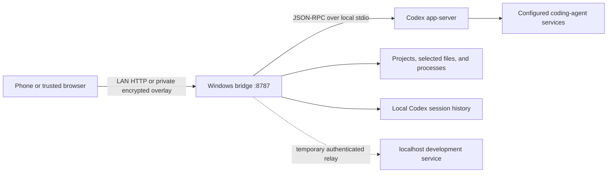

# Architecture

## Purpose

Codex LAN Console gives an authenticated phone or browser a remote interface to
the Codex environment already installed and signed in on one Windows computer.
It is a local-first, single-user system. It does not operate a central cloud
service and is not designed as a multi-tenant server.

## Repository boundaries

```text
frontend/
  web/       Static responsive UI shared by browsers and mobile wrappers
  android/   Android WebView shell and foreground notification service
  ios/       iOS UIKit/WKWebView shell and background-refresh integration
backend/
  bridge/    Windows HTTP bridge and Codex app-server adapter
  bridge.tests/
             Protocol and policy test harness
```

The web frontend is compiled as static content into the bridge output. It is not
an independently deployed web server. Android and iOS provide native credential
storage, navigation, file integration, and notification behavior around the
same authenticated web experience.

## Runtime topology



Tailscale and Headscale are external network layers and are not embedded in the
clients. The supported remote path is a private encrypted overlay between the
phone and computer. Direct public-Internet exposure is outside the design.

## Backend responsibilities

The ASP.NET Core bridge:

- serves the bundled web frontend;
- issues and validates paired-device credentials;
- exposes the internal mobile HTTP API;
- starts and communicates with `codex app-server` through local standard input
  and output;
- reads persisted task history without subscribing to the task, acquires an
  app-server subscription only for interaction, and calls `thread/unsubscribe`
  after a completed turn or bounded idle period;
- paginates and bounds task data for mobile display;
- tracks approval, question, task, and notification state;
- dispatches every app-server host request to a protocol-specific handler,
  including MCP elicitations and automatic current-time responses, and rejects
  unknown future methods immediately instead of leaving a turn blocked;
- validates and stores uploads, and leases workspace files for authenticated
  viewing or download;
- lists related projects and processes and supports narrowly confirmed process
  stops;
- maps eligible localhost HTTP links through short-lived authenticated relays;
  and
- observes recent Codex session state for notifications created by a separate
  desktop Codex process.

The bridge does not take ownership of an active task controlled by another
Codex app-server process. It can report external state, but mutating operations
are rejected when concurrent control would be unsafe.

## Frontend responsibilities

The web frontend renders tasks, Markdown, projects, processes, approvals,
questions, permissions, files, commands, skills, tools, goals, and status. It
loads only the newest bounded task page by default and requests older pages
explicitly. MCP form and URL elicitations are rendered as native mobile
controls with a JSON-object fallback for extended schemas.

The Android client stores connection credentials with Android Keystore,
supports system file selection and download, and maintains an opt-in foreground
service for timely notifications.

The iOS client stores credentials in Keychain and integrates WKWebView, native
navigation, file sharing, and opportunistic background refresh. iOS does not
guarantee continuous background polling; reliable suspended-state delivery
would require a separately designed APNs service.

## Authentication and session flow

1. The bridge creates a ten-minute six-digit code on startup and writes it to
   the local pairing file. Administrator Mode does this only for initial setup
   or after the local manager writes a protected one-shot enrollment request.
2. A client submits the code to the pairing endpoint.
3. The bridge rate-limits failures, issues a random 256-bit bearer token, stores
   only its SHA-256 hash, invalidates the used code, and sets an HttpOnly session
   cookie. Standard Mode rotates to another time-limited code; Administrator
   Mode closes the window after one enrollment.
4. Native clients keep the raw token in platform-protected storage and can use
   it to restore the web session.
5. All API routes except health and pairing require a valid bearer token or
   session cookie.

There is currently no individual remote-device revocation UI. Deleting the
bridge data root revokes every paired device.

## Data and lifecycle

Bridge-managed state is stored under `%LOCALAPPDATA%\CodexLanConsole`. Uploaded
copies and their leases are retained for up to 30 days, notifications for up to
7 days and 500 events, registered workspace-file leases normally for 1 day, and
localhost relay grants for about 10 minutes. See PRIVACY.md for the complete
inventory and deletion behavior.

Codex session history and workspace files are external data. The Console reads
or references them but does not own their lifecycle.

## Permission model

Task execution combines a sandbox profile with an approval policy. Presets range
from read-only to full autonomous. Full autonomous maps to full filesystem
access and no per-operation approval. For a bridge-owned full-autonomous turn,
the bridge also resolves residual protocol-level command, file, permission, and
MCP tool approvals; this keeps `never` meaningful even when a skill has its own
authorization layer. Persistent global auto-approval remains a separate,
explicit bridge setting.

Organization and administrator policies remain authoritative. The frontend
must display the effective permission state accurately and must never imply
that a rejected policy was bypassed.

## Resource boundaries

Task messages are fetched through cursor pagination. The bridge rejects unsafe
full-history clients and limits a single app-server response before JSON
materialization. Upload count, per-file size, total request size, preview paths,
collections, headers, and relay leases are bounded.

These controls reduce accidental exhaustion but do not make the bridge safe for
hostile public traffic. The threat model assumes a private network and a small
number of trusted paired devices.

## Change rules

A change requires architecture and threat-model review when it adds a cloud
service, new listener, new persistent data, cross-device sharing, untrusted
plugin execution, automatic approval behavior, broader file/process access,
new identity provider, or a second independently deployed frontend service.
